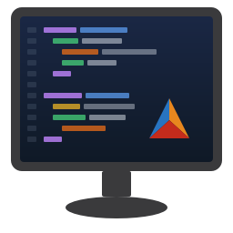

<p align="center">
  
</p>

<h1 align="center">Clarion Assistant</h1>

<p align="center">
  <strong>AI-powered coding assistant for the Clarion IDE</strong><br>
  Embeds Claude Code directly into your Clarion development workflow
</p>

<p align="center">
  <a href="https://github.com/ClarionLive/ClarionAssistant/releases/latest"></a>
  
  
</p>

<p align="center">
  <em>An independent community project &mdash; not a SoftVelocity product.</em><br>
  <a href="docs/HISTORY.md">History, stats &amp; contributors</a>
</p>

---

## What is Clarion Assistant?

Clarion Assistant is an IDE addin that brings AI-powered code intelligence to [Clarion](https://softvelocity.com) developers. It runs as a docked terminal pane inside the Clarion IDE, giving you a conversational coding assistant that understands your entire codebase.

Ask it to write Clarion code, explain procedures, refactor classes, build COM controls, convert Clarion apps to C#, or navigate your solution &mdash; all without leaving the IDE.

### Key Capabilities

- **Write and edit Clarion code** directly in the IDE editor
- **Multi-tab terminal** &mdash; multiple Claude Code sessions with independent workspaces
- **Language Server (LSP)** &mdash; real-time code intelligence with go-to-definition, find references, hover info, diagnostics, and rename support
- **CodeGraph** &mdash; solution-wide code intelligence via SQL queries over every symbol, relationship, and call chain
- **DocGraph** &mdash; instant search across 14,000+ indexed documentation chunks (Clarion core, CapeSoft, Icetips, and more)
- **SchemaGraph** &mdash; database schema intelligence from Clarion dictionaries, SQL Server, SQLite, and PostgreSQL
- **Source Control** &mdash; GitHub and Bitbucket integration with per-solution repo linking
- **Build tools** &mdash; build solutions, individual apps, or C# COM controls without leaving the chat
- **Class intelligence** &mdash; parse CLASS definitions, sync .inc/.clw, generate method stubs
- **Application tree** &mdash; open .app files, list procedures, navigate the embeditor
- **Monaco source editor** &mdash; the default editor for Clarion `.clw`/`.inc` source: syntax highlighting, folding, F12/Ctrl+Click go-to-definition, inline diagnostics, and completion (toggleable under Options &rarr; Clarion Assistant &rarr; Editor Surfaces)
- **Smart Formatter (Ctrl+I)** &mdash; reformats Clarion code with structure indentation and aligned declarations; configurable
- **CA Embeditor** &mdash; use Clarion's own **Embeditor Source** (right-click a procedure, or the Views toolbar button) and a fast Monaco/WebView2 editor overlays the native embeditor automatically; edits save straight back with Clarion-native Save &amp; Exit
- **Embed navigation (Ctrl+J / Ctrl+B)** &mdash; jump to the next/previous *filled* embed, the same keys the native Clarion embeditor uses (#185); the toolbar arrows and an unfiltered walk over every embed are there too, and all of it is rebindable
- **Code Snippets (Ctrl+Shift+J)** &mdash; classic Clarion template-picker parity: insert reusable code with tab-stops and a `${SELECTED}` placeholder, managed from Settings &rarr; Snippets
- **CA Explorer** &mdash; docked pad showing the active CA Embeditor tab's Local, Module &amp; Global Data, Declared Tables, Other Files, and their Keys, Columns, and Relations; drag a field to the editor or Window designer, copy/paste variables native-style, and a Cheat Sheet tab of editor shortcuts
- **Evaluate Code** &mdash; interactive code review for entire apps, procedures, open files, or selected code
- **CA Find & Replace** &mdash; dockable Find pad or classic in-editor overlay (your pick), Find-All with results in their own editor tab, and one shared history across every CA surface
- **Document Structure** &mdash; fly-out outline of the current buffer with symbol icons, Class &#9656; Methods regrouping, and filtering; click to navigate
- **Diff viewer** &mdash; Monaco-based side-by-side diffs with syntax highlighting, live-buffer diffing, and a current-line comparison panel
- **Knowledge system** &mdash; persistent cross-session memory for decisions, patterns, and gotchas
- **Zoom persistence** &mdash; Ctrl+mousewheel zoom is saved and restored across sessions

---

## What's New (Unreleased)

Work landed since 5.7 is documented here as it merges — see [the release-docs workflow](docs/releases/README.md), and run `Check-ReleaseDocs.ps1` before cutting a release.

<!-- release-docs: covered=codegraph -->
### Indexing is thirty times faster

The hour-long index is gone. Measured on the same 27-app production solution: a full index that took **1:12** now completes in **2:42** inside the IDE (1:53 from the standalone indexer). The cost was never the disk &mdash; the relationship pass was testing every line of code against all six thousand callable names, one substring scan at a time. It now splits each line into identifiers once and looks them up in a hash table, and a full row-by-row comparison of the old and new databases (347,203 symbols, 1,023,354 relationships) confirmed the output is **identical to the edge** &mdash; just thirty-three times sooner.

An **Update** with nothing changed returns in a quarter of a second; with changes it costs about the relationship pass (~2 minutes on a solution this size), since relationship resolution still rebuilds solution-wide. Two indexes can no longer collide: starting one while another is writing the same database &mdash; from the toolbar or from either MCP index tool &mdash; is refused with a clear message instead of silently corrupting the graph.

<!-- release-docs: covered=mcp -->
### The index tools stream their progress

`index_solution` and `index_codegraph` were the same spinning cursor in MCP form: an hour of silence, then a wall of text &mdash; or worse, "index started" and no way to know it finished. With a progress-capable client (the in-IDE Claude tab qualifies), both tools now stream **live progress** &mdash; weighted percentage, the file being parsed &mdash; and `index_solution` waits for the run and returns the real completion stats: symbols, relationships, duration, database path, and where the transcript landed. Long calls stay alive through the progress stream itself; a three-minute index verified end-to-end without a client timeout. Clients that don't send a progress token get exactly the old behavior.

<!-- release-docs: covered=codegraph -->
### Indexing finally shows its work

A full index of a large solution runs for over an hour, and until now the only sign anything was happening was a spinning cursor. Starting an index now opens a **progress window**: every app in the solution listed up front and ticked off as it parses, the file being read right now, a progress bar weighted by where the time actually goes (relationship resolution dominates, so the percentage tracks the clock instead of sprinting to a quarter and crawling), elapsed time, and an estimate seeded from your previous run &mdash; "last full index took 1:07" &mdash; until live throughput takes over.

Indexing can now be **cancelled** mid-run. A cancelled full index deletes the partial database rather than leaving something that would quietly pass for a complete one; a cancelled update keeps your old data and says plainly not to trust it until re-run. When the run finishes, the window becomes the report &mdash; symbols and relationships parsed, duration, and any warnings &mdash; with one button to copy the summary and another to open the **full transcript**, which is now always written to disk (`%APPDATA%\ClarionAssistant\codegraph-index.log`, one file per solution, previous run kept) so it survives even if the IDE doesn't.

<!-- release-docs: covered=codegraph -->
### CodeGraph stops giving confidently wrong answers about who calls what

The entry below this one made the index twice as big; this one makes it tell the truth. Field testing on a 27-app production solution found that "who calls X" could answer with the wrong X entirely: when the same procedure name exists in several apps &mdash; and in generated Clarion code, dozens do &mdash; every call in every app resolved to one arbitrary copy. Not missing answers. Wrong ones.

Call resolution is now scoped the way the compiler thinks: the same file first, then the same project, then the projects yours actually depends on. On that test solution, every one of 27 apps now resolves its calls to its own copy, and the share of calls crossing project boundaries fell from 49% to the 24% that genuinely are DLL calls. Where several same-named overloads truly cannot be told apart, the pick is now deterministic and **marked** &mdash; a new `ambiguous` flag on the relationship says "one of several" instead of asserting certainty the index doesn't have.

Three more answers the graph could not give before:

**"Is this the declaration or the body?"** MAP prototypes and real implementations carried identical rows, making go-to-definition a coin flip &mdash; and quietly poisoning the documented dead-code query, which turned out to return 98.7% false positives (it filtered on exactly the prototype rows, which never receive calls). A new `decl_kind` column separates prototype, implementation, and external; the dead-code recipe is fixed in the docs, and calls never resolve to a prototype when a body exists.

**"Where does DO go?"** Routine calls &mdash; the primary control flow inside any generated Clarion procedure &mdash; were never captured: the schema documented the edge type, and there were zero rows, partly because routine labels with colons (`BRW10::ProcessScroll`, which is to say most of them) didn't even match the pattern. The test solution now carries 29,326 of them, each resolved to the routine of the right procedure.

**"Which of these eight is the real one?"** A global declared in one DLL appears in every app that imports it, and the rows were indistinguishable. Externals are now marked as such, and every symbol carries its declaration line in `source_preview` &mdash; so results explain themselves without opening a single file.

Field testing round two found one more, and it was the biggest single blind spot of all: **a procedure whose label contains a colon was never indexed as a procedure**. In template-generated code that is the entire referential-integrity layer &mdash; every `RIDelete:` and `RIUpdate:` procedure, nearly nineteen thousand declarations in the test solution &mdash; and because the relationship scanner shared the same blind spot, whole `_RD`/`_RU` files contributed no edges at all: the cascade-delete graph simply did not exist, and "what breaks if I delete from this table" returned nothing. One character class in four patterns. After the fix the test solution gained 31,860 symbols and 52,483 relationships, and every routine in those files found its owning procedure.

Field testing round three then asked "which variables are never used?" and found the reference side had the same disease twice over. **Routine bodies were never scanned at all** &mdash; not for references, not for calls, not for `DO`: a `ROUTINE` label switched the scanner off, and in generated Clarion most of the real work lives in routines. And a second, older bug turned out to have been quietly amputating scans since the beginning: the everyday statement `DO ProcedureReturn` **prefix-matched the scanner's PROCEDURE pattern** &mdash; it believed a procedure named "DO" had just been defined and stopped reading the body right there. One missing word boundary. Together the repairs took the test solution from 478 thousand relationships to **1.1 million**: routines now emit their calls and references and can be told live from dead (false "dead routine" readings fell from 60% to 9%), unused-variable analysis on locals dropped from 64% false positives to 37%, and class data members &mdash; previously 100% blind &mdash; now receive reference edges. A full index does take proportionally longer; it is reading the half of your code it used to skip.

Field testing round four asked the follow-up question &mdash; "so who uses this *global*?" &mdash; and found the answer was being **delivered to the wrong address**. A global owned by one DLL appears in every app that imports it via an `EXTERNAL` declaration, and the per-file reference scan handed each app's usage edges to its own local import row &mdash; so the *owning* declaration, the one you actually navigate to, looked nearly unused (owners collected about a quarter of the references; the import rows absorbed the rest). References to an external now re-point to the owning declaration, so "who uses this global" is asked once, at the real one. Two more finds landed alongside it: **a routine's own `DATA` block was never scanned for declarations** &mdash; 9,261 routine-local variables across 890 generated files simply didn't exist in the index, and every reference to them emitted nothing (they're captured now, parented to their routine); and a hand-written library file with **two top-level `MAP` blocks** &mdash; a common shape for modules that also declare Win32 imports &mdash; derailed the scanner's first-procedure detection and silently contributed *zero* edges from the whole file.

**Re-index after updating**, same as below &mdash; existing databases keep their old answers until re-run.

<!-- release-docs: covered=codegraph -->
### CodeGraph indexes more than twice as much of your solution &mdash; including, at last, your globals

Measured against a real 27-app production solution, the index went from 170 thousand symbols to 385 thousand, and from 53 thousand call relationships to 392 thousand. Not from new cleverness in the parser &mdash; from finally looking where your code actually is.

The biggest miss was the redirection file. The indexer resolved source by convention &mdash; `.\source`, project root &mdash; and only consulted a `.red` if one sat next to the `.sln`. Most installs keep it in the Clarion `bin` folder, so every file your `.red` places elsewhere &mdash; shared class sources, `Compile\` output &mdash; silently fell off the index. The indexer now uses the same active redirection the IDE has loaded, and the standalone indexer takes `--red`.

Second: **global data was never indexed.** The declaration section of your main PROGRAM file &mdash; six thousand lines of it, in one app we measured &mdash; was skipped entirely, so no global variable, GROUP, or EQUATE existed anywhere in the graph. They are indexed now, with `scope='global'`, so "where is this global declared?" finally has an answer. Declarations sized with nested parentheses &mdash; `CSTRING(CHR(10))` &mdash; also no longer vanish, a quiet loss that had applied to locals too.

The two indexing tools also stopped disagreeing: `index_codegraph` ran without the library paths and redirection that `index_solution` used, so how complete your database was depended on which one had run last. They now share one implementation. Include chains are followed recursively instead of one level deep, and the addin and the standalone `clarion-indexer` are built from one shared source instead of two copies that had already drifted apart.

Finally, the index now audits itself. Every file the indexer touches gets a row in a new `indexed_files` table saying what happened to it &mdash; parsed, empty, unresolved, or skipped and why &mdash; and the run ends with a warning naming anything that did not resolve rather than leaving silence. On its first real run that audit caught a genuine bug: two files whose `$`-containing names the project file stores percent-encoded, which the indexer had been dropping without a trace. Fixed, of course.

**Re-index your solutions after updating** &mdash; the improvements apply to what gets indexed, so existing databases keep their old blind spots until re-run.

<!-- release-docs: covered=source-editor -->
### Template files listed in the editor settings now actually open in the editor

`.tpl` and `.tpw` were in the Editor Surfaces file-type list out of the box, and adding them changed nothing. The setting was not being ignored &mdash; it was never consulted, because the IDE only ever offered our editor the file types the stock Clarion editor already handles. Anything else was decided before our code got a say, so the list could name a type all it liked and no one ever asked.

Our editor now also claims the types you have explicitly listed. Only those: it adds to what the stock editor would have opened and never takes anything away, and a type you have not asked for is left exactly where it was. Turning the master Editor Surfaces switch off returns everything to Clarion's own editor as before.

A second problem sat underneath, and it was the quieter of the two. Writing an entry the way file filters are normally written &mdash; `*.tpl` rather than `.tpl` &mdash; produced a pattern that could never match any file. It did not warn or fall back; the entry simply sat there doing nothing, which reads exactly like the feature being broken. Both spellings work now, as do `tpl`, and `*.*` no longer turns "every file" into "no files".

<!-- release-docs: covered=installer -->
### The Markdown editor now installs with Clarion Assistant &mdash; the maintained one

Markdown files have been openable in the IDE for a while, but only if you went and found the addin yourself. It now ships in the installer, pinned to a specific upstream release the same way the bundled language server is.

The version that ships is [Mark Sarson's](https://github.com/msarson/ClarionMarkdownEditor), which began as our own editor and has been developed well past it since. Pointing our installer at the maintained line means one editor to report problems against instead of two drifting copies, and it is why a markdown question is best raised upstream rather than here.

It installs as its own addin, not as part of Clarion Assistant, because that is what it is &mdash; useful whether or not you use any AI tooling, and removable on its own.

**If you already have it, we will not touch it unless ours is newer.** The check reads the version out of the addin's own manifest rather than trusting the DLL's version resource, which upstream leaves frozen at `1.0.2.0` across every release &mdash; so anyone tracking upstream directly, or installing through Mark's addin finder, keeps the newer copy. The MIT licence travels with it, and the installer build now fails outright if that notice ever goes missing, alongside the existing check that fails the build when a component would ship absent without saying so.

<!-- release-docs: covered=deploy -->
### A release could ship with no language server and say so almost silently

Building a release in a fresh checkout produced an addin with no language server in it. The only sign was a single grey line among thirty green ones, and it happened only on the *first* build in a new tree &mdash; every later build worked, which made it look like flaky timing rather than a defect.

The cause was that the deploy script captured the language-server build's own console output as if it were the path that build returned. The path was still in there, last, behind every line git and npm had printed. What made it dangerous is how it failed: the check guarding the copy still passed, so the step looked alive while quietly skipping the server.

The build transcript still prints &mdash; it is a minute of genuinely useful output &mdash; it just no longer contaminates the value the function hands back.

<!-- release-docs: covered=prompt,installer -->
### The embedded assistant knows about every tool it has &mdash; this time in the copy that ships

An audit before 5.7 found 51 registered tools documented nowhere in the assistant's system prompt &mdash; the build tools, TXA/DCTX import and export, SchemaGraph, Everything search, multi-instance coordination, generation traces and more. The assistant simply never reached for them, because as far as its instructions were concerned they didn't exist.

That audit landed in the wrong file. The prompt lives in two places: a bundled copy the installer ships, and a per-project copy the addin writes on every terminal start. The fix went into the second, which is overwritten from the first each time a terminal opens &mdash; so the repository was correct and every shipped build was not. 5.7 went out with the Jul 30 prompt, still missing all 51.

Both copies are now the same document, and a check enforces that they stay that way: it fails loudly on drift and names the tools the shipped prompt would omit, since the whole failure mode here was staying quiet.

Auditing that fix turned up a third copy. The installer also wrote `clarion-assistant-reference.md` into your `.claude` folder from a separate hand-maintained file, and that one had drifted further still &mdash; eight whole tool sections missing, and a tool documented that no longer exists. It is gone; the reference now comes from the same bundled prompt as everything else. Three copies of a document is three chances to be wrong, so there is one.

If you noticed the assistant ignoring a tool you knew it had, this was why.

<!-- release-docs: covered=docgraph -->
### Documentation search stops mangling accented characters

Every non-ASCII character in the ingested documentation came back corrupted: em-dashes as `&acirc;&euro;&rdquo;`, "Inicio R&aacute;pido" as "Inicio Rápido". The documents themselves were never at fault &mdash; they declare `<meta charset="UTF-8">` and are valid UTF-8 on disk. The ingester simply read them as the machine's ANSI codepage instead.

Not a forgotten argument, either, which is why it survived two previous encoding sweeps: the wrong encoding was passed *explicitly*, so an audit hunting for reads that omitted one walked straight past it. The same assumption sat in the CHM path, over the HTML files a decompiled help file leaves behind.

HTML is the one format here that declares its own character set, so it now gets a ladder that respects that: byte-order mark, then the document's own declaration, then a validating UTF-8 attempt, then ANSI. A document claiming UTF-8 is deliberately not taken at its word &mdash; it is verified, so a mislabelled file falls back rather than filling your search results with replacement characters.

Measured against the affected documents, the corruption goes to zero &mdash; 240 occurrences in one Spanish reference, 7 in its English counterpart, none introduced anywhere.

**Re-import any documentation you have already ingested.** The fix corrects reading, not what is already stored; existing entries keep their mangled text until re-run.

<!-- release-docs: covered=assistant -->
### The assistant picks up what it was left waiting on

Deploying a new build closes the assistant's terminal, and until now anything it had been asked to do next died with it. That is the worst possible moment to lose the thread, because waiting for that deploy is usually *why* something was still outstanding &mdash; a re-index to run, a corpus to re-import, a check to repeat once the new build is in.

It now records outstanding work the moment it becomes blocked rather than at the end of a session, since a session that ends by being killed has no end to write at. On its next start it leads with what was pending instead of waiting to be reminded.

---

## What's New in v5.7

5.7 is a parity-and-reliability release. Full notes: **[docs/releases/v5.7.0.md](docs/releases/v5.7.0.md)**.

### Native embeditor parity &mdash; Ctrl+J / Ctrl+B

The CA Embeditor answers **Ctrl+J** (next filled embed) and **Ctrl+B** (previous) like the native one, wrapping at either end and acting on the focused split pane ([#185](https://github.com/ClarionLive/ClarionAssistant/issues/185), BoxSoft). The code-snippet picker moves to **Ctrl+Shift+J** &mdash; Ctrl+J is classic Clarion's snippet gesture in the *text* editor, but the *embeditor* owes it to embed navigation &mdash; and becomes rebindable like every other command, so it can be put back if you prefer. An unfiltered **Next/Previous Embed (any)** ships unbound.

### Errors-pane navigation survives opening a generated .clw

Clicking a row for one procedure after another row had opened the generated `.clw` appeared to do nothing. The reveal was always computing the right line &mdash; but the embeditor is a view *inside* the application window rather than a tab of its own, so raising it needed both levels, and opening the `.clw` closes the native embed underneath, leaving a surface where **Save** said "nothing to save" and **Cancel** blanked the buffer. Such a row now goes to Clarion's own navigation, which re-opens the embeditor properly.

### A language server call can no longer freeze the IDE

An embed save or cancel could hang the IDE for close to a minute &mdash; measured at 57.7s &mdash; waiting synchronously on an async language-server call from the UI thread. An audit found **twelve** such sites, not the two reported, so the pattern is fixed rather than one more symptom. Separately, an application **global** flagged `'X' is not declared in this file` while hovering correctly as a global is suppressed pending the upstream fix ([Clarion-Extension issue 396](https://github.com/msarson/Clarion-Extension/issues/396)).

### Community fixes

**Go-to-definition** stops resolving to an unrelated procedure's local variable ([#182](https://github.com/ClarionLive/ClarionAssistant/pull/182)) &mdash; a guard the hover path already used and the definition path never called. The **editor follows Clarion's live font** ([#183](https://github.com/ClarionLive/ClarionAssistant/pull/183)): it had been reading a property the Options dialog no longer writes to, so font changes never reached the editor. Both from [@geircodes](https://github.com/geircodes). Reviewing #183 turned up a way to lose your own font &mdash; with following on, any unrelated gear change persisted the IDE's font as your stored preference &mdash; fixed before release, along with the same shape in cursor-behind-EOL.

### Folds, encoding, search, installer

Collapsed **folds** are restored on reopen (the state saved but always read back empty), and an ambiguous drifted fold is refused rather than collapsing the wrong region. The Windows-1252 **encoding** sweep is finished &mdash; nineteen more reads, two of them read-modify-*write* &mdash; and reads no longer decode every file twice. **CA Search** opens in your theme instead of always dark ([#181](https://github.com/ClarionLive/ClarionAssistant/issues/181)). The **installer** checks that a folder's Clarion version matches the row it was entered in, and a row now accepts several folders for the same version via **`+`**, closing the gap 5.5's known issues warned about.

### Thanks

- **[@geircodes](https://github.com/geircodes)** &mdash; [#182](https://github.com/ClarionLive/ClarionAssistant/pull/182) and [#183](https://github.com/ClarionLive/ClarionAssistant/pull/183), with reproducers and live verification against a real IDE.
- **Adrián Santarelli** &mdash; the WebView2 post-after-dispose fix, reporting [#179](https://github.com/ClarionLive/ClarionAssistant/issues/179), and the original Ctrl+J snippet requests ([#49](https://github.com/ClarionLive/ClarionAssistant/issues/49), [#154](https://github.com/ClarionLive/ClarionAssistant/issues/154)).
- **BoxSoft** &mdash; [#185](https://github.com/ClarionLive/ClarionAssistant/issues/185), the embed-navigation hotkeys.

---

## What's New in v5.6

Documentation search is the headline: PDF text extraction now works on every machine instead of only ones that happened to have a third-party tool installed, the extracted text is more accurate, and it is indexed so that a question is answered by the first result rather than the fifth query. Alongside that, a cycle of fixes across the diagnostics path, completion scoping, and the CA Editor's Monaco overlay &mdash; plus a build fix that restores Clarion 10 to the shipped set.

<!-- release-docs: covered=docgraph -->
### PDF documentation actually imports &mdash; and is correct (#167)

Importing a folder of PDFs reported "No documentation files found", naming `pdf` as supported in the very message saying nothing was there. The files were found. Text extraction shelled out to an external `pdftotext.exe` that CA never bundled and nothing it requires installs &mdash; not Git for Windows, contrary to what the code's own probe paths assumed. So PDF import worked only on machines where a developer happened to have put one, and silently produced nothing everywhere else.

Extraction is now in-process (PdfPig, Apache-2.0), so it works everywhere with no external dependency.

The bigger surprise was accuracy. Where the old path *did* run, it misaligned multi-column tables: in the Language Reference's date-picture table it paired `@D6` (`dd/mm/yyyy`) with `10/1959` &mdash; which is `@D14`'s value, and cannot be a `dd/mm/yyyy` rendering of any date &mdash; while dropping other cells entirely. Every row now reads correctly. Those tables are exactly what a Clarion developer searches the documentation for, so the old path was not merely unavailable; where it ran, it was indexing wrong answers.

> **Re-import your own PDFs.** Anything already in a personal DocGraph was indexed through the old path and keeps the old text. The bundled documentation shipped with this release is already rebuilt.

### Documentation search answers the question, not the index (#167)

Extraction being correct is not the same as the answer being findable. Asking which three categories `ASCIIFileClass`'s non-virtual methods divide into took **five** queries; it now takes one, and the answer is the first result.

Four things were wrong at once. **Nothing identified the owning class** &mdash; every chunk in the ABC Library Reference was labelled with the book's name, and since every ABC class has an identically-named "Occasional Use" subsection, results from five different classes interleaved with nothing to tell them apart. **Table-of-contents pages outranked real content**: 28.7% of the index was dot-leader lines, which are almost pure keyword, so searching a class name returned page-number lists ahead of prose. **Clarion keywords lifted out of example code became headings** &mdash; 486 chunks titled `ACCEPT`, `PROGRAM` or `RETURN`, including the one holding the ASCIIFileClass text. And **subsection labels were splitting sections apart**, so the three categories landed in three different chunks and no single result could answer the question.

Chunks now carry their real class, contents pages rank below prose, headings read `ASCIIFileClass > GetLastLineNo`, and a section stays whole. Property references in the Language Reference (`PROP:NumTabs` and the rest) get their own headings too, so the definition outranks a passing mention in an example.

Verified against a fixed set of eight retrieval tests, kept with the code at [`ClarionAssistant/docs/DocGraph-Chunking-Verification.md`](ClarionAssistant/docs/DocGraph-Chunking-Verification.md), including a guard on the date-picture table above so a future chunking change cannot quietly undo the extraction fix.

Index-noise suppression currently covers documentation whose contents pages put the title and page number on one line &mdash; SoftVelocity's and CapeSoft's. BoxSoft's manuals wrap them across two lines and are not yet recognised.

### Spot which libraries need re-importing

The Documentation Graph panel (Settings &rarr; Data &rarr; Info) gains a **Type** column showing each library's source format, and every column header &mdash; Library, Type, Vendor, Chunks &mdash; is now a sort toggle. Click **Type** to group the PDFs together, which is the fastest way to see what wants a re-import after this release.

### The installer remembers where your Clarion actually is (#142)

Setup derived each Clarion path fresh on every run, registry first, and discarded whatever you corrected in the wizard. If your Clarion isn't where SoftVelocity's installer registered it &mdash; a second copy, or one launched with `/Configdir=` against its own settings folder &mdash; you had to re-enter the path on every release, and forget once.

That failure is quiet: the addin lands in a tree you don't launch, the IDE keeps loading the old one, and the symptoms get reported against a build replaced weeks ago. Paths a run actually installs to are now remembered and offered next time, and validated on read so a tree that has since moved falls back to detection.

### Diagnostics stop reporting false corruption (#168)

Clarion source is saved as Windows-1252/ANSI with no BOM, but four `File.ReadAllText` calls on the LSP text-sync path read it with no encoding argument &mdash; and .NET only auto-detects via BOM. Every single-byte high-bit character (a copyright symbol, say) silently became `U+FFFD` *before* the text reached the language server, which then correctly flagged the replacement character it had been handed. The result was waves of "this character will corrupt the file" warnings &mdash; dozens per file &mdash; on files that are perfectly valid on disk. All four sites now read through `EncodingHelper.DetectFileEncoding`, the same helper the diff viewer got in #94.

### Squiggles stop vanishing (#170)

The squiggle overlay could render nothing at all for a file that the diagnostics pill correctly reported an error for moments later. Four defects, one symptom, all rooted in treating "no information yet" as "authoritatively zero": a premature empty LSP republish was trusted as final (the server publishes progressively, and a slower cross-file check can land in a later batch); a timed-out round-trip was folded into an empty marker list, which *erased* every existing squiggle and its gutter mark rather than merely failing to add one; the client's timeout sat below the host's own worst case, discarding slow-but-successful analyses; and the settle loop parked a thread-pool thread per request. Empty results now get a short settle window before being believed, a timeout leaves the rendered markers alone, the diagnostics call gets its own longer budget while completion and hover keep their short interactive one, and the wait is properly async.

### Diagnostics window follows the CA Editor's theme &mdash; and appears at all (#169)

The LSP status bar and the diagnostics popup rendered in the chat pane's theme, which is a separate setting from the CA Editor's own. They now follow the **active editor's** theme, tracked per Monaco surface rather than read from a process-wide mirror that only ever recorded whichever page spoke last.

Three correctness bugs surfaced in the same code path and are fixed here too. The status bar pill **never appeared** when the IDE's own ClarionLsp addin was the active client &mdash; the visibility check asked the bundled `LspClient`, which in that configuration is never started, so the pill was hidden on every tick and the window it opens was unreachable. Both the liveness check and the cache read now go through `SharedLspBridge`, and the target file is resolved from the active editor instead of "the last file any LSP tool touched". The pill also stopped claiming a green **OK** for files nothing had ever been published about &mdash; unknown now renders as its own muted state rather than being flattened into "clean" during exactly the window when results are still arriving, and the status bar **asks** for diagnostics when it finds none cached instead of reporting "unknown" indefinitely at a cache nothing else was going to fill. And severity colours now survive a live dark&#8646;light switch instead of keeping the previous theme's palette until the rows next rebuilt.

Rounding it out: owner-drawn column headers and grid lines that actually follow the theme, a selection highlight that no longer overrides each row's severity colour, a dark-mode-aware native title bar, and no more hover flicker.

### Completion stops leaking other procedures' locals (#172)

Follow-up to #159. The CodeGraph backfill in bare-prefix completion matched symbol names across the whole indexed solution with no scope awareness, so a variable declared **private to some unrelated procedure in a different file** was offered exactly like a genuine global &mdash; typing `Include` at the top of a PROGRAM file could surface an `IncludeAddress` local from elsewhere entirely. Symbols the indexer already tags as procedure-private are now filtered out of that merge. Locals in the procedure you're actually standing in are unaffected: those come from a live-buffer parse, not the database.

### `DO` completes routines, and only routines

`DO` takes a ROUTINE label and nothing else, so it is now its own completion context answered from routines alone. Routine names are read **from the live buffer**, scoped to the enclosing procedure &mdash; which is a routine's real visibility in Clarion &mdash; so a routine you just typed and haven't saved completes too. Previously `DO` was answered from the general symbol set: typing `DO ref` offered methods from an unrelated `Reflection` class while missing the `RefreshWindow` routine a few lines up.

### Ctrl+X in the CA Editor reaches the clipboard (#173)

Clarion-style Ctrl+X posted the cut text to the host before deleting it from the buffer &mdash; and the CA Editor never implemented its half of that contract, so **Ctrl+X deleted the line without putting anything on the Windows clipboard**. Both stubs left inert since the original overlay spike are now wired: the cut text reaches `Clipboard.SetText`, and a Data-pad field dropped directly onto the editor surface now returns activation to the editor's own tab instead of leaving focus stranded on the pad.

### Show the diagnostics bar again after dismissing it

The LSP status bar &mdash; the strip at the bottom of the assistant pane carrying the diagnostics pill &mdash; has always had its own **&#10005;**, and nothing brought it back: restarting Clarion was the only way. A **&#9678;** button joins the header's title-row actions, beside the theme toggle, and shows or hides it on demand. It repaints from the current state on the way back rather than returning with whatever it was showing when dismissed.

<!-- release-docs: covered=deploy -->
### Clarion 10 builds again

`DiffService` called a `FileService` method that doesn't exist on Clarion 10's older SharpDevelop fork, so the C10 build had been failing outright since the CA Compare write-back work landed &mdash; while 11, 11.1 and 12 compiled clean. It now reaches the same information through an API present on every fork, from one code path.

**If you run Clarion 10, this release is the first to include roughly a week of changes** that never made it into a working C10 binary. The installer ships a per-Clarion build (`bin\Debug-C10` and siblings), so a broken build for one release meant that release shipping stale or not at all.

The deploy script no longer lets one bad target take the others down with it, either: a build failure for a single Clarion version used to abort the run *before* the deploy step, so **nothing** was deployed anywhere while the console showed the other three building successfully. Failures are now collected, every version that built is deployed, and the run ends by naming what didn't ship.

<!-- release-docs: covered=create-class -->
### Class model preview renders again (#171)

In **Create New Class**, any model whose declaration put a Clarion keyword and a quoted string on the same line &mdash; a standard `CLASS,TYPE,MODULE('X.CLW'),LINK('X.CLW')` &mdash; rendered visibly broken markup instead of coloured code. The keyword pass ran over the HTML the string pass had just produced and matched the literal `class` and `string` inside its own attributes. The two passes are now ordered so there is no HTML for the keyword pass to collide with.

### Smart formatter keeps comments where they belong (#161)

Two fixes to **Ctrl+I**, both reported and diagnosed by [@geircodes](https://github.com/geircodes).

A comment sitting among declarations &mdash; inside a `GROUP`/`QUEUE`/`RECORD`/`FILE`, or directly in a procedure's or routine's DATA section &mdash; was indented to the CODE-section column rather than the field column it had been aligned to. It visibly jumped left while every declaration around it formatted correctly, which read as arbitrary rather than as a rule; comments inside `IF`/`CASE`/`LOOP` bodies were never affected, which is what made it look inconsistent. Those comments now line up with the fields they sit among &mdash; and a long banner comment does *not* drag the whole structure's field column to the right with it.

**"Indent comments" now means what it says.** Switching it off used to *delete* a comment's indentation and dump it at column 1, including comments hand-aligned deep inside nested control structures. Off now means leave the comment exactly where it is.

### Thanks

- **geircodes** &mdash; the bulk of this cycle again: the LSP source-encoding fix that ended a wave of false "this character will corrupt the file" warnings (#168), the squiggle overlay going blank on slow or premature results (#170), the diagnostics window's theme plus three correctness bugs found alongside it &mdash; including the status bar pill that never appeared at all (#169), the completion scope leak that surfaced other procedures' locals solution-wide (#172), the CA Editor clipboard and drop-focus stubs (#173), and the class-model preview highlighting (#171). Also reported, diagnosed and wrote the patch for the Ctrl+I comment-indenting fixes (#161), filing it as an issue with the semantics question open rather than as a PR &mdash; which is why "Indent comments OFF" now means something deliberate.
- **Bill Atchison** &mdash; reporting that PDFs would not import (#167). The bug was invisible to anyone whose machine happened to carry a stray `pdftotext.exe`, which is every developer machine here; without the report it would have kept shipping.
- **BoxSoft** &mdash; the installer path report (#142) that turned out to be the reason a whole diagnostic round was spent chasing symptoms in a build that had already been replaced.

---

## Release History

Summaries for **v5.5 and earlier** &mdash; back to v3.0 &mdash; are archived in **[docs/releases/CHANGELOG.md](docs/releases/CHANGELOG.md)**.

Full per-release notes live in **[docs/releases/](docs/releases/)**.

---

## Also Included: COM for Clarion

The installer bundles **COM for Clarion**, a complete toolkit for creating .NET COM controls that work with Clarion:

- **IDE addin** &mdash; browse, discover, and manage COM controls from inside Clarion
- **UltimateCOM template** &mdash; Clarion template and class for embedding COM controls in your apps
- **ClarionCOM tooling** &mdash; project templates, build scripts, and deployment tools for creating your own C# COM controls
- **COM Marketplace** &mdash; access community-published controls from [clarionlive.com](https://clarionlive.com)

---

## Installation

### Prerequisites

| Requirement | Notes |
|---|---|
| **Clarion IDE** (v10, v11, or v12) | Auto-detected from Windows registry |
| **Claude Code CLI** | [Download from Anthropic](https://claude.ai/download) |
| **WebView2 Runtime** | Pre-installed on Windows 11; [download for Windows 10](https://developer.microsoft.com/en-us/microsoft-edge/webview2/) |

### Install

1. **[Download the latest installer](https://github.com/ClarionLive/ClarionAssistant/releases/tag/v5.3.0)** (code-signed)
2. Close the Clarion IDE
3. Run the installer &mdash; select which Clarion versions to install for
4. Restart the Clarion IDE

**One row per Clarion version, and they are not interchangeable.** Each row installs the addin *built for that version*, compiled against that Clarion's own IDE assemblies &mdash; so pointing the "Clarion 10 folder" row at a Clarion 12 installation ships the wrong build and it won't load. The installer now checks the version of whatever folder you enter and warns you if it doesn't match the row.

**More than one installation of the same version?** That's supported &mdash; press the **`+`** button on that version's row and pick the extra folder. Each extra gets a copy of that row's addin once the install finishes, and the list is remembered for next time. Handy if you keep, say, two Clarion 12 trees side by side.

> One trap worth knowing: never leave a spare or backup copy of the addin folder anywhere *inside* an `accessory\addins` tree. Clarion scans subfolders, and a duplicate makes startup fail with *"Identity name used by multiple addins."* Keep backups outside.

### What Gets Installed

| Component | Location | Description |
|---|---|---|
| Clarion Assistant addin | `{Clarion}\accessory\addins\ClarionAssistant\` | Main addin DLL, WebView2, SQLite, HTML terminal |
| COM for Clarion addin | `{Clarion}\accessory\addins\ComForClarion\` | COM browser addin |
| UltimateCOM template | `{Clarion}\accessory\template\win\` | .tpl, .inc, .clw, and template DLLs |
| Documentation | `{Clarion}\accessory\resources\ComForClarionDocumentation\` | COM for Clarion docs |
| Claude Code plugin | `%USERPROFILE%\.claude\plugins\...\clarion-assistant\` | 20+ Clarion-specific skills, hooks, and docs |
| Code quality agents | `%USERPROFILE%\.claude\agents\` | 6 agents (won't overwrite existing) |
| ClarionCOM tooling | `%APPDATA%\ClarionCOM\` | Project templates and scripts |
| DocGraph database | `%APPDATA%\ClarionAssistant\` | Pre-loaded Clarion 12 documentation index |

Your existing Claude Code settings are preserved &mdash; the installer merges permissions non-destructively.

---

## MCP Tools Reference

Clarion Assistant exposes **108 MCP tools** that Claude uses to interact with the IDE:

### IDE & Editor (23 tools)
| Tool | Description |
|---|---|
| `get_active_file` | Get path and content of the open file |
| `open_file` | Open a file in the editor, optionally at a line |
| `close_file` | Close the active editor tab |
| `save_file` | Save the active file |
| `get_open_files` | List all open editor tabs |
| `go_to_line` | Navigate to a specific line in the open file |
| `get_cursor_position` | Get current line, column, and total line count |
| `get_line_text` | Get text of a specific line from the live buffer |
| `get_lines_range` | Get a range of lines from the editor |
| `get_selected_text` | Get the currently selected text |
| `get_word_under_cursor` | Get the word at the cursor position |
| `select_range` | Select/highlight a range of text in the editor |
| `insert_text_at_cursor` | Insert text at the current cursor position |
| `replace_text` | Find and replace all occurrences in the active editor |
| `replace_range` | Replace text between specific line/column positions |
| `delete_range` | Delete text between specific line/column positions |
| `find_in_file` | Search for text in the active editor buffer |
| `toggle_comment` | Toggle Clarion line comments on a range of lines |
| `is_modified` | Check if the active file has unsaved changes |
| `undo` | Undo the last edit |
| `redo` | Redo the last undone edit |
| `show_diff` | Show a side-by-side diff in the Monaco viewer |
| `get_diff_result` | Get approval/notes from the diff viewer |

### Application Tree & Embeditor (21 tools)
| Tool | Description |
|---|---|
| `get_app_info` | Get info about the currently open app |
| `list_procedures` | List all procedures in the open app |
| `get_procedure_details` | Get detailed procedure info (prototype, module, template) |
| `select_procedure` | Select a procedure in the app tree |
| `open_procedure_embed` | Open the embeditor for a procedure |
| `get_embed_info` | Get info about the active embeditor |
| `list_embeds` | List all embed sections with filled status |
| `find_embed` | Find and navigate to an embed section by name |
| `next_embed` / `prev_embed` | Navigate to the next/previous embed point |
| `next_filled_embed` / `prev_filled_embed` | Navigate to the next/previous filled embed |
| `get_embed_content` | Read code inside a specific embed slot |
| `get_embeditor_source` | Get full annotated embeditor source with embed markers |
| `search_embeditor_source` | Regex search over annotated embeditor source |
| `open_embeditor_source` | Open the embeditor source in the editor |
| `write_embed_content` | Write code into an embed slot by line number |
| `save_and_close_embeditor` | Save changes and close the embeditor |
| `cancel_embeditor` | Discard changes and close the embeditor |
| `export_txa` | Export app or procedures to TXA format |
| `import_txa` | Import a TXA file into the app |

### Code Intelligence (11 tools)
| Tool | Description |
|---|---|
| `get_solution_info` | Get current solution, Clarion version, RED file, and CodeGraph status |
| `index_codegraph` | Index the solution for CodeGraph queries |
| `index_solution` | Index all projects in the solution |
| `list_codegraph_databases` | List available indexed CodeGraph databases |
| `query_codegraph` | SQL queries over every symbol, relationship, and call chain |
| `get_project_source_files` | List all source files (.clw, .inc) with absolute paths |
| `analyze_class` | Parse CLASS definitions from .inc files |
| `sync_check` | Compare .inc declarations vs .clw implementations |
| `generate_stubs` | Generate method stubs for missing implementations |
| `generate_clw` | Generate a complete .clw implementation from a .inc file |
| `generate_source` | Generate .clw/.inc source from templates |

### LSP &mdash; Language Server (9 tools)
| Tool | Description |
|---|---|
| `lsp_start` | Start the Clarion Language Server |
| `lsp_debug_status` | Check LSP server status |
| `lsp_definition` | Go to definition of a symbol (cross-file) |
| `lsp_references` | Find all references to a symbol across the workspace |
| `lsp_hover` | Get type info, signature, and documentation for a symbol |
| `lsp_document_symbols` | Get all symbols in a file |
| `lsp_find_symbol` | Search for symbols across the workspace by name |
| `lsp_diagnostics` | Get errors and warnings for a source file |
| `lsp_rename` | Propose a rename of a symbol (returns edit list for approval) |

### Schema Intelligence (10 tools)
| Tool | Description |
|---|---|
| `search_tables` | Search database tables by name |
| `get_table` | Full table detail with columns, keys, relationships |
| `search_columns` | Find columns across all tables |
| `get_relationships` | Show parent/child table relationships |
| `query_schema` | Run SQL queries against the schema index |
| `schema_stats` | Get schema database statistics |
| `ingest_schema` | Index a Clarion dictionary (.dctx) |
| `ingest_sql_database` | Index schema from SQL Server, SQLite, or PostgreSQL |
| `export_dctx` | Export dictionary to .dctx format |
| `import_dctx` | Import a .dctx dictionary |

### Documentation Search (6 tools)
| Tool | Description |
|---|---|
| `query_docs` | Full-text search across all indexed documentation |
| `ingest_docs` | Index docs from a Clarion installation's accessory/Documents folder |
| `ingest_web_docs` | Ingest documentation from web URLs |
| `list_doc_libraries` | List all indexed libraries with chunk counts |
| `discover_docs` | Preview discoverable doc sources without ingesting |
| `docgraph_stats` | Get DocGraph database statistics |

### Build Tools (5 tools)
| Tool | Description |
|---|---|
| `build_solution` | Build the entire Clarion solution via ClarionCL.exe |
| `build_app` | Build a single .app file (for multi-DLL solutions) |
| `build_com_project` | Build a C# COM control via MSBuild |
| `run_command` | Execute any command-line tool |
| `execute_command` | Execute a shell command |

### File System & Search (7 tools)
| Tool | Description |
|---|---|
| `read_file` | Read file content from disk with optional line range |
| `write_file` | Write content to a file |
| `append_to_file` | Append text to an existing file |
| `list_directory` | List files in a directory with optional pattern filter |
| `search_files` | Search for files by name |
| `search_files_advanced` | Advanced file search with Everything integration (path, extension, size, date filters) |
| `search_content` | Search file contents by text |

### Project & IDE (4 tools)
| Tool | Description |
|---|---|
| `get_ca_project_info` | Get linked GitHub/Bitbucket account and repo for a project |
| `get_red_search_paths` | Get RED file search paths for the active solution |
| `resolve_red_path` | Resolve a filename to an absolute path via RED search paths |
| `inspect_ide` | Inspect Clarion IDE internal state |

### Knowledge & Memory (6 tools)
| Tool | Description |
|---|---|
| `add_knowledge` | Save reusable insights (decisions, patterns, gotchas) across sessions |
| `query_knowledge` | Search past decisions and patterns |
| `save_session_summary` | Save a session summary for next-session continuity |
| `query_traces` | Query code generation traces |
| `trace_stats` | Get trace database statistics |
| `log_skill_update` | Log a skill update event |

### Multi-Instance Coordination (4 tools)
| Tool | Description |
|---|---|
| `list_instances` | List all running Clarion Assistant instances |
| `get_instance_messages` | Get messages from other instances |
| `send_to_instances` | Send a message to other instances |
| `check_conflicts` | Check for file conflicts across instances |

### Validation (2 tools)
| Tool | Description |
|---|---|
| `validate_names` | Validate Clarion naming conventions |
| `find_duplicates` | Find duplicate symbols in the solution |

---

## Claude Code Skills

The installer includes 22 Clarion-specific skills for Claude Code (installed as a plugin):

| Skill | Description |
|---|---|
| `clarion` | Clarion language reference &mdash; syntax, data types, control structures, Windows API patterns |
| `clarion-ide-addin` | IDE addin development with SharpDevelop integration |
| `clarion-analyze` | Analyze Clarion code generation traces for recurring failure patterns |
| `clarion-benchmark` | Benchmark Clarion code generation quality |
| `clarion-convert-driver` | Convert Clarion dictionaries between file drivers (e.g., TopSpeed to SQLite) |
| `evaluate-code` | Evaluate Clarion app code for issues and improvements |
| `jfiles` | jFiles JSON serialization patterns for Clarion |
| `lsp-diagnostics` | Run LSP diagnostics across all source files in the open solution with navigate-to-error support |
| `ClarionCOM` | Interactive COM development assistant |
| `clarioncom-build` | Build COM projects with MSBuild |
| `clarioncom-config` | Manage ClarionCOM settings |
| `clarioncom-control` | Create and validate C# COM controls for Clarion |
| `clarioncom-create` | Create new C# COM control projects from scratch |
| `clarioncom-deploy` | Generate deployment artifacts |
| `clarioncom-get` | Download controls from the marketplace |
| `clarioncom-github-init` | Initialize GitHub repos for COM projects |
| `clarioncom-marketplace-submit` | Submit controls to the COM Marketplace |
| `clarioncom-validate` | Validate RegFree COM compliance |
| `clarioncom-webview2-build` | Build WebView2 COM control projects |
| `clarioncom-webview2-create` | Create WebView2-based COM controls with HTML/CSS/JS |
| `clarioncom-webview2-deploy` | Generate deployment artifacts for WebView2 COM controls |
| `clarioncom-webview2-validate` | Validate WebView2 COM controls for RegFree compliance |

---

## Building from Source

### Requirements

- Visual Studio 2022 (Community or higher)
- .NET Framework 4.8 SDK
- Clarion IDE (for reference assemblies in `{Clarion}\bin\`)
- [Inno Setup 6](https://jrsoftware.org/isdownload.php) (for building the installer)

### Configuring your Clarion path

The build uses `Directory.Build.props` at the repo root to locate your Clarion installation. The defaults assume John's machine layout (`C:\Clarion12`, `C:\Clarion11-13372`, `C:\Clarion10`).

If your Clarion is installed elsewhere, create a `Directory.Build.props.user` file alongside `Directory.Build.props` (it is gitignored — never commit it):

```xml
<Project>
  <!-- Replace with your actual Clarion installation path -->
  <PropertyGroup>
    <ClarionRoot>C:\Clarion\Clarion12</ClarionRoot>
  </PropertyGroup>
</Project>
```

The `.user` file overrides the defaults for all `ClarionVersion` values, so a single path entry is enough if you only build for one version. You can still pass `/p:ClarionVersion=11` on the command line to select the target version.

Alternatively, pass the path directly on the command line without creating a `.user` file:

```powershell
msbuild ClarionAssistant.csproj /p:ClarionVersion=11 /p:ClarionRoot="C:\Clarion\Clarion11.1"
```

### Build

```powershell
# Build for a specific version (uses Directory.Build.props.user if present)
cd ClarionAssistant
msbuild ClarionAssistant.csproj /p:Configuration=Debug /p:ClarionVersion=12

# Build the addin for all Clarion versions via deploy script
.\deploy.ps1 -NoBuild:$false -Version all
```

> **Note:** Use MSBuild directly — do **not** use `dotnet build`. WebView2 NuGet resolution fails with the .NET CLI on this .NET Framework 4.8 project.

### Deploy for Development

```powershell
# Deploy to your local Clarion IDE (builds + copies DLLs)
cd ClarionAssistant
.\deploy.ps1 -Version 12

# Deploy without rebuilding (e.g. HTML-only changes)
.\deploy.ps1 -Version 12 -NoBuild

# Kill the IDE before deploying (when DLLs are locked)
.\deploy.ps1 -Version 12 -Kill
```

### Running the tests

```powershell
cd ClarionAssistant
.\tests\Run-Tests.ps1
```

One entry point for both harness families: standalone `csc` harnesses over IDE-free service code
(`tests\`), and node harnesses over the Monaco WebView2 pages (`Terminal\test\`). Neither is wired into
MSBuild &mdash; they exist to be run before you deploy, because the bugs they catch (a NUL byte inside a
420 KB HTML file, a settings panel that reads fine in dark mode and is illegible in light) pass a clean
build and fail a human.

Most need nothing installed. One page test needs `jsdom`, declared as a devDependency:

```powershell
npm install --prefix Terminal\test
```

Without it that test reports *could not run* and fails the overall run rather than reporting green. See
[`tests/README.md`](ClarionAssistant/tests/README.md) for what each harness guards.

---

## Acknowledgments

Clarion Assistant is built with the help of these open-source projects and contributors:

### Contributors

| Name | Contribution |
|---|---|
| [Mark Sarson](https://github.com/msarson/Clarion-Extension) | Clarion Language Server Protocol implementation for VS Code, which the LSP integration in Clarion Assistant is based on |

### Open Source Libraries

| Library | Description | License |
|---|---|---|
| [xterm.js](https://github.com/xtermjs/xterm.js) | Terminal emulator (v6.0.0) | MIT |
| [Newtonsoft.Json](https://github.com/JamesNK/Newtonsoft.Json) | JSON serialization (v13.0.3) | MIT |
| [System.Data.SQLite](https://system.data.sqlite.org) | SQLite database with FTS5 full-text search | Public Domain |
| [Microsoft WebView2](https://github.com/MicrosoftEdge/WebView2Feedback) | Embedded browser runtime | MIT |
| [Everything SDK](https://www.voidtools.com) | Instant file search by voidtools | Freeware |
| [recursive-improve](https://github.com/kayba-ai/recursive-improve) | Recursive improvement pattern for code generation | MIT |

---

## License

[MIT License](LICENSE) &mdash; &copy; 2025-2026 ClarionLive.

The MIT license covers Clarion Assistant's own source. The installer additionally bundles third-party components that keep their own licenses &mdash; PdfPig (Apache-2.0), the Microsoft Edge WebView2 runtime, SQLite, and Node.js with the bundled language server. Clarion IDE assemblies are referenced from your existing Clarion installation and are not redistributed.
